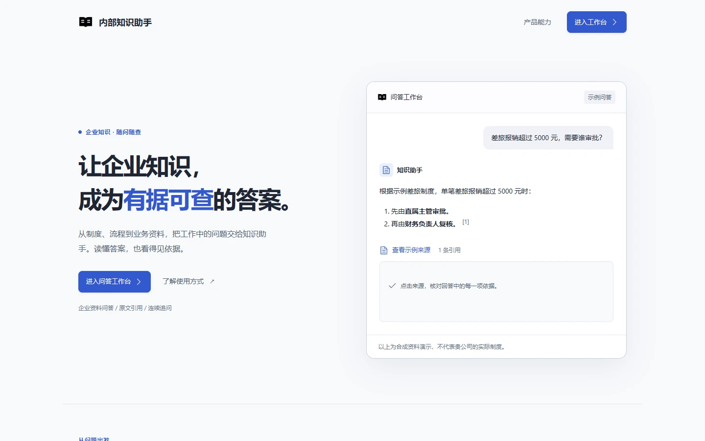
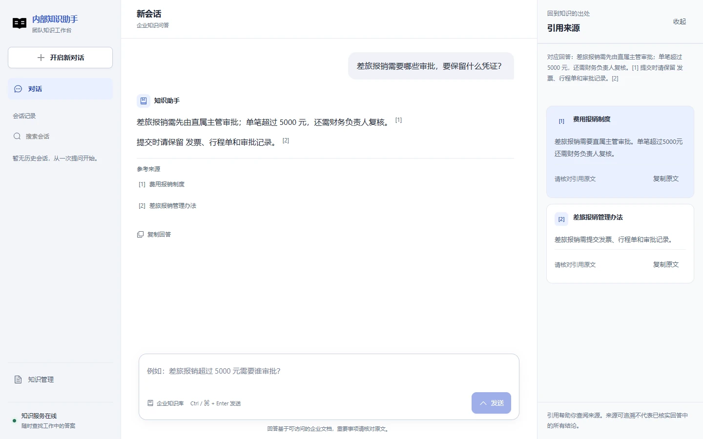
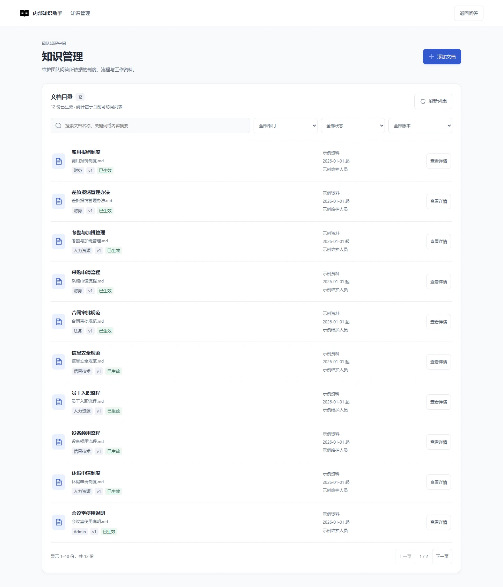
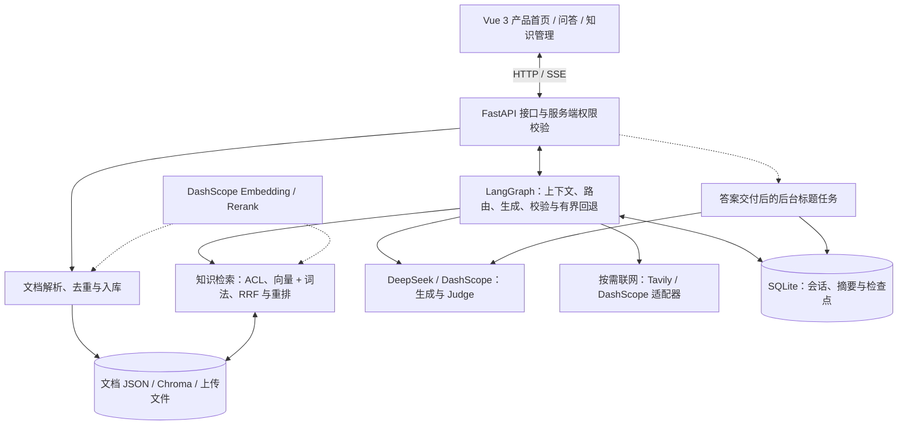

# 企业内部知识助手

一个基于 `LangGraph + DeepSeek/Qwen + FastAPI + Vue 3` 的企业内部知识问答项目，用于将企业制度、流程、合同、财务、人事等内部文档接入知识库，并通过 RAG 提供可检索、可追溯的问答能力。

[界面预览](#界面预览) · [系统架构](#系统架构) · [快速启动](#快速启动本地开发) · [当前交付状态](#当前交付状态2026-09-28)

## 项目简介

这个项目面向企业内部场景，核心目标是把企业内部文件沉淀为可检索知识库，并让员工通过对话方式查询制度、流程和规范。

当前能力包括：

- 企业内部知识问答
- 知识库、通用两种会话模式：知识库模式严格依据内部证据，通用模式支持按需联网搜索
- 文件上传并写入知识库
- RAG 检索与回答校验
- 时间、知识库和联网搜索工具统一返回可序列化的 `tool_result`（`ok`、`text`、`sources`、`error`），并保留兼容的字符串 `tool_output`
- 有界多轮会话、自动摘要、首问会话标题生成与完整会话删除
- SSE 状态与正式答案交付；普通通用非联网回答支持增量预览
- Vue 3 产品首页、问答工作台与独立知识管理（FastAPI 接口集成）
- 知识库两层去重
  - 精确去重：内容指纹
  - 近似去重：文本相似度阈值

完整的项目建设顺序、技术选型依据、评测过程和失败闭环见
[《企业内部知识助手：从原型到可评测 RAG 系统的建设思路》](docs/企业内部知识助手_项目建设思路.md)。
Vue 前端的设计系统、目录和当前接入边界见 [frontend/README.md](frontend/README.md)。
统一 RAG 评测目录、运行方式和门禁见
[《统一 RAG 评测》](docs/unified_rag_evaluation.md)。
GitHub 提交边界和本地运行文件清单见
[《GitHub 提交边界》](docs/repository_submission_guide.md)。

## 界面预览

以下截图来自当前 Vue 页面，问答与文档列表使用确定性合成资料，仅展示界面和交互，不代表真实模型回答质量或企业业务数据。图片随仓库提供，无需访问本地 `work/` 目录。

**产品首页**



**知识问答与引用来源**



**知识管理**



## 系统架构

下图为组件关系，省略了节点内部的有界重试与错误分支；默认本地开发身份不等于企业账号系统。



- 知识库回答使用稳定证据标识消除跨轮编号歧义，验证后转换为接口引用；前端再显示为上标 `[1]`。图中的引用/Judge 流程以本地 `judge` 模式说明，仓库仍保留 `legacy` 模式。
- Tavily 路径检索网页摘要后调用文本模型生成答案；网页来源映射校验不等于独立事实审核。普通通用非联网回答可提前显示预览，`result` 始终是正式结果。
- 文档查看、下载、检索及会话操作都执行服务端授权；模型/工具调用有预算和重试上限。标题任务不阻塞答案交付，目前为单进程最佳努力队列。

具体节点见 [graph.py](backend/agent/graph.py)，接口见 [routes.py](backend/api/routes.py)，配置见 [config.py](backend/config.py)。

## 快速启动（本地开发）

需要 Python 3.11+、Node.js 20.19+ 或 22.12+（Vite 7 支持的版本）与各供应商有效凭据。以下使用 PowerShell，在两个终端分别运行前后端。

**1. 获取源码并安装依赖**

```powershell
git clone https://github.com/hjunhui0924-gif/inner_QA_agent.git
cd inner_QA_agent
python -m pip install -r requirements.txt
npm --prefix frontend ci
```

**2. 配置环境变量**

首次运行复制模板；若已有 `.env`，保留并按需修改，不覆盖现有凭据：

```powershell
if (-not (Test-Path -LiteralPath .env)) {
    Copy-Item -LiteralPath .env.example -Destination .env
}
```

编辑根目录 `.env`，按下表选择配置。完整参数见下方“环境变量”。

| 配置 | 必需设置 |
|---|---|
| 保留仓库默认 DashScope | 填写 `DASHSCOPE_API_KEY`；默认文本、Embedding、重排及搜索均走 DashScope，账户需有对应模型权限/额度 |
| 使用当前本地验收组合 | 设置 `MODEL_PROVIDER=deepseek`、`MODEL_NAME=deepseek-v4-pro`、`JUDGE_MODEL_NAME=deepseek-v4-pro`、`CITATION_VALIDATION_MODE=judge`、`WEB_SEARCH_PROVIDER=tavily`；填写 DeepSeek、Tavily、DashScope 各自密钥 |

DeepSeek/Tavily 组合仍由 DashScope 提供 Embedding 和重排。仅体验知识库问答可关闭联网，不需要调用 Tavily。服务不是完全离线运行，真实模型调用可能消耗额度。

**3. 启动后端（终端一，项目根目录）**

```powershell
python -m uvicorn backend.main:app --reload --host 127.0.0.1 --port 8000
```

首次启动会初始化本地 SQLite、Chroma 和种子资料索引，可能调用 Embedding 服务；等待日志显示 `Application startup complete`。项目自带资料为合成种子，不是真实公司制度。

**4. 启动前端（终端二，项目根目录）**

```powershell
npm --prefix frontend run dev -- --host 127.0.0.1 --port 5173 --strictPort
```

| 地址 | 用途 |
|---|---|
| <http://127.0.0.1:5173> | 产品首页 |
| <http://127.0.0.1:5173/chat> | 问答工作台 |
| <http://127.0.0.1:5173/knowledge> | 知识管理 |
| <http://127.0.0.1:8000/health> | 后端健康检查 |
| <http://127.0.0.1:8000/docs> | FastAPI 接口文档 |

Vite 将 `/api` 请求代理到 8000 端口，开发时无需另设前端 API 地址。若启动失败，先检查凭据、模型权限/额度与端口占用；修改 `.env` 后重启后端。`AUTH_MODE=development` 仅用于本地开发，不作为公网多人部署配置。

## 技术栈

- `LangGraph`：Agent 工作流编排
- `LangChain`：消息、文档、工具与模型接口
- `DeepSeek / Qwen（DashScope）`：可配置文本生成与 Judge
- `DashScope`：Embedding 与重排
- `Tavily / DashScope`：可配置联网搜索
- `FastAPI`：后端接口
- `Vue 3 + Vite + TypeScript + Element Plus`：默认 Web 前端
- `SQLite`：用户记忆、会话历史
- `Chroma`：向量检索库

## 目录结构

```text
backend/
  agent/
  api/
  config.py
  main.py
frontend/
  src/
    components/
    views/
    styles/
  package.json
  vite.config.ts
data/
  knowledge_base.json
requirements.txt
README.md
```

## 环境要求

- Python 3.11+
- Conda 环境即可，不要求额外创建虚拟环境
- Node.js 20.19+ 或 22.12+ 与 npm（Vite 7 支持的版本）

## 安装依赖

```bash
pip install -r requirements.txt
```

安装 Vue 前端依赖：

```bash
cd frontend
npm install
```

## 环境变量

复制 `.env.example` 为项目根目录的 `.env` 并填写自己的凭据。模板默认保留 DashScope + legacy 校验配置；以下为该配置示例（不是当前本地验收配置）：

```env
MODEL_PROVIDER=dashscope
DASHSCOPE_API_KEY=你的DashScopeKey
CITATION_VALIDATION_MODE=legacy
WEB_SEARCH_PROVIDER=dashscope
MODEL_NAME=qwen3.8-flash
JUDGE_MODEL_NAME=qwen3.8-flash
QWEN_ENABLE_THINKING=false
WEB_SEARCH_MODEL=qwen3.8-flash
WEB_SEARCH_ENDPOINT=https://dashscope.aliyuncs.com/api/v1/services/aigc/multimodal-generation/generation
WEB_SEARCH_TIMEOUT_SECONDS=20
CONVERSATION_TOKEN_BUDGET=12000
CONVERSATION_SUMMARY_TRIGGER_TOKENS=10000
CONVERSATION_SUMMARY_TARGET_TOKENS=1500
CONVERSATION_RECENT_TURNS=4
EMBEDDING_PROVIDER=dashscope
EMBEDDING_MODEL=qwen3.7-text-embedding
EMBEDDING_DIMENSIONS=1024
EMBEDDING_INDEX_VERSION=v4
RETRIEVAL_STRATEGY=rerank
RETRIEVAL_DENSE_CANDIDATE_K=20
RETRIEVAL_LEXICAL_CANDIDATE_K=20
RETRIEVAL_RERANK_CANDIDATE_K=12
RETRIEVAL_DENSE_WEIGHT=0.5
RETRIEVAL_LEXICAL_WEIGHT=0.5
RERANKER_ENABLED=true
RERANKER_MODEL=gte-rerank-v2
RERANKER_API_STYLE=native
TRACE_ENABLED=false
TRACE_INCLUDE_CONTENT=false
TRACE_RETENTION_DAYS=30
AUTH_MODE=development
AUTH_DEV_USER_ID=user_001
AUTH_DEV_ROLES=employee,knowledge_reader,knowledge_admin
AUTH_DEV_DEPARTMENTS=
AUTH_DEV_SCOPES=internal
AUTH_DEV_INTERNAL_USER=true
AUTH_PROXY_SECRET=
REQUEST_MAX_MODEL_CALLS=12
REQUEST_MAX_TOOL_CALLS=2
REQUEST_MAX_TOTAL_SECONDS=60
REQUEST_MAX_INPUT_TOKENS=0
REQUEST_MAX_OUTPUT_TOKENS=0
REQUEST_MAX_ESTIMATED_COST=0
MODEL_INPUT_PRICE_PER_1K=0
MODEL_OUTPUT_PRICE_PER_1K=0
```

当前本地验收使用 DeepSeek 文本模型与 Tavily 搜索，可在上述配置基础上替换以下项：

```env
MODEL_PROVIDER=deepseek
DEEPSEEK_API_KEY=你的DeepSeekKey
DEEPSEEK_BASE_URL=https://api.deepseek.com
MODEL_NAME=deepseek-v4-pro
JUDGE_MODEL_NAME=deepseek-v4-pro
CITATION_VALIDATION_MODE=judge
WEB_SEARCH_PROVIDER=tavily
TAVILY_API_KEY=你的TavilyKey
```

Embedding 与重排仍使用 DashScope，需要保留 `DASHSCOPE_API_KEY`。上述三个服务分别使用各自凭据，不能互换；不包含 DeepSeek 原生联网能力。配置在后端启动时读取，变更后重启。模板中的价格为 0 表示未配置估算价格，不代表免费。

会话上下文使用保守的中英文混合 Token 估算。达到 10000 Token 时，系统使用
`MODEL_NAME` 配置的模型将较早对话压缩到约 1500 Token，保留最近 4 轮和当前问题；如果
最近对话本身过长，会继续压缩更早轮次以满足 12000 Token 的会话预算。摘要模型
不可用时会退化为确定性截断。现有路由器会利用摘要判断短追问是否仍需进入 RAG；
检索失败后，`rewrite_query` 会结合摘要和最近对话补全追问中的指代，再重新检索。
删除会话时同时删除业务聊天记录和对应 LangGraph
Checkpoint，因此复用原会话 ID 也不会恢复旧上下文。同一会话的流式回答与删除在
当前进程内串行执行，避免删除完成后正在运行的回答重新写回会话；单条用户消息如果
已经超过为当前问题预留的会话预算，会在进入 Agent 前被拒绝。

每个新会话在第一次提问前选择一次模式，开始对话后模式锁定；如需切换，必须开启
新对话。知识库模式只允许使用内部知识证据，无关问题会拒答并建议切换通用模式。
通用模式可以直接回答开放问题；联网搜索必须由用户显式开启，关闭时不会因问题关键词自动联网。
本地使用 Tavily 检索网页摘要，再由 DeepSeek 生成带来源回答；也保留 DashScope 原生搜索适配器。
接口使用 `[C1]` 等引用标记，前端映射为论文式上标 `[1]`，点击后可查看原文或网页来源。
联网资料与企业内部证据分开展示，标记为“搜索服务提供的来源”；没有可用原文时不提供原文复制。
首问答案交付后，有界后台队列生成会话标题；旧标题在读取列表时限量入队，不阻塞回答或列表响应。

工具执行结果同时保留结构化字段和现有字符串兼容字段。工具异常使用稳定错误码，
不会把内部路径、上游响应正文或异常堆栈送入生成提示、SSE 或 Trace；搜索没有可验证
URL 时不会创建伪来源。搜索无结果、服务异常、答案缺有效引用分别返回
`web_search_no_results`、`web_search_unavailable`、`web_answer_invalid`，不交付无效候选。
Tavily 使用独立 `TAVILY_API_KEY`，DashScope 原生搜索使用 DashScope 凭证。搜索超时由 `WEB_SEARCH_TIMEOUT_SECONDS` 控制；模型、工具
调用及已知 Token 用量计入请求预算。网页引用只验证来源指针，不能替代全文事实校验。

每次问答请求创建独立的 `RequestBudget`，默认最多 12 次模型调用、2 次工具调用和
60 秒总耗时；输入/输出 Token 与估算费用上限默认为 0（关闭）。预算对象只存在本轮
Runtime context，SSE `result` 和 Trace 仅保存可序列化的 `budget_snapshot`，不会写入
checkpoint。达到调用、耗时、Token 或费用限制时，系统提交安全 fallback，不交付未校验
的候选答案。

服务端权限默认通过 `AUTH_MODE=development` 提供本地单用户身份，仅用于本地开发；
多用户部署必须切换为 `AUTH_MODE=trusted_headers`，并只允许可信反向代理在校验
`AUTH_PROXY_SECRET` 后注入用户、角色、部门、scope 和内部用户标记。请求体中的
`user_id`、上传表单中的 `access_scope` 以及前端隐藏状态都不构成身份或授权依据。
知识库 ACL 默认拒绝，显式 deny 优先，scope 使用 all-of，部门精确匹配；召回前会
先按 ACL 过滤向量和词法候选，来源查看与下载、会话读写和知识库管理入口也会做服务端授权。
未完成可信身份接入、历史文档 ACL 迁移和权限验收前，不宣称满足多用户企业生产安全要求。

仓库默认文本模型为 `qwen3.8-flash`；当前本地验收配置为 DeepSeek `deepseek-v4-pro`。自动语义校验通过 `JUDGE_MODEL_NAME` 配置，当前与生成模型相同，同模型 Judge 不构成独立质量证明。模型选择和历史小样本结果见 [回答与搜索优化说明](docs/answer_search_optimization.md)；最新配置与验收边界见 [产品体验收尾报告](docs/product_experience_final_acceptance.md)。原有 34 题为法规开发集，另有企业制度分层评测集，不能将开发集成绩视为生产准确率。

默认使用 DashScope `qwen3.7-text-embedding` 作为中文语义检索模型。Embedding
提供方、模型、维度或索引版本发生变化时，系统会自动使用新的 Chroma
collection，避免新旧向量混用。无网络的本地开发可显式设置
`EMBEDDING_PROVIDER=hashing`，但该模式仅提供词法检索能力，不应作为生产配置或
正式评测结果。

本次 Embedding 模型切换将索引版本提升为 `v4`；首次启动或执行入库时会创建新的
collection 并重新生成向量，不会复用旧的 `text-embedding-v3` 向量。

知识库去重不再使用语义向量：完全重复使用规范化内容指纹，近重复使用保守的字符
shingle 重合率。这样可以跳过格式略有差异的文件副本，同时保留主题相似但规则不同
的制度文档。

知识库记录现在使用稳定 `id`、`source_type`、`department`、`version`、`status`、
`effective_from`、`effective_to`、`owner`、`access_scope` 和 checksum。每个 chunk
都会保留这些来源元数据；查询可以按来源、部门、状态和生效日期过滤，问题包含“当前/现行/最新”
时会优先当前有效版本。仓库内的企业制度是合成种子数据，统一标记为 `synthetic_seed`，
不应当当作真实公司政策。

检索默认同时运行语义召回与 BM25 式中文词法召回，再通过 RRF 融合排序。词法召回
用于补足文号、金额、日期和制度原词等精确匹配场景，语义召回用于处理同义表达；
融合后的候选再通过 `gte-rerank-v2` 进行精排。远程精排超时或异常时自动降级为
RRF 结果，不中断问答。Rerank 模型与端点均可配置，模型说明以
[阿里云文本排序官方文档](https://help.aliyun.com/zh/model-studio/text-rerank-api)为准。

仓库中只保留 `.env.example`，不要提交真实 `.env`。

本地构建产物、Python/pytest 缓存、前端依赖、运行时数据库、Chroma 索引、上传文件、
Trace 和浏览器验收产物已经写入 `.gitignore`。知识库种子、评测题集、官方语料和当前
已跟踪的评测报告属于项目可复现资料，默认继续保留；详细边界和移除已跟踪报告的注意事项
见 [GitHub 提交边界](docs/repository_submission_guide.md)。

## 本地验证

前后端启动顺序见上方“快速启动”。以下命令在项目根目录执行。

### 单元测试与构建

```powershell
python -m pytest tests -q
npm --prefix frontend test
npm --prefix frontend run build
```

若未安装 pytest，先运行 `python -m pip install pytest`；浏览器测试依赖单独列在 `requirements-e2e.txt`。前端构建包含 TypeScript 类型检查。

### MVP 浏览器验收

浏览器验收脚本覆盖会话新建、模式切换、流式回答、引用证据、继续追问、会话删除、知识库上传、筛选、文档详情和来源下载。后端解析、持久化和权限仍由 Python 测试直接验证。

先启动 5173 端口的前端，并确保已安装本机 Chrome 或 Edge：

```powershell
python -m pip install -r requirements-e2e.txt
python tests/e2e_mvp_browser.py
```

该脚本通过浏览器边界注入确定性 API 响应，不消耗在线模型额度。更多浏览器与隔离真实模型验收步骤见 [前端说明](frontend/README.md) 和 [M6 执行清单](docs/product_experience_optimization_plan.md)。

Vue 是项目唯一前端，旧 Streamlit 入口已移除。直接跨域开发时，由后端 `.env` 中的 `FRONTEND_ORIGINS` 配置允许来源；默认 Vite 代理无需额外改动。

## 主要接口

### 1. 对话流式接口

```http
POST /chat/stream
```

请求体示例：

```json
{
  "message": "查询广州今天的天气",
  "user_id": "user_001",
  "session_id": "session_uuid",
  "mode": "general",
  "web_search": true
}
```

`mode` 可取 `knowledge` 或 `general`；`web_search` 仅在通用模式下生效。

### 2. 上传知识文件

```http
POST /knowledge/upload
```

示例：

```bash
curl -X POST "http://localhost:8000/knowledge/upload" \
  -F "file=@./your_internal_doc.pdf" \
  -F "title=员工报销制度" \
  -F "source=finance_policy"
```

### 3. 查看知识条目

```http
GET /knowledge/records
```

### 4. 查看历史会话

```http
GET /chat/sessions/{user_id}
```

### 5. 删除历史会话

```http
DELETE /chat/session/{user_id}/{session_id}
```

### 6. 健康检查

```http
GET /health
```

## 官方文档检索 Benchmark

项目提供了一套可复现的多文档检索消融实验。语料来自以下官方原始页面：

- [中华人民共和国个人信息保护法](http://www.npc.gov.cn/npc/c2/c30834/202108/t20210820_313088.html)（中国人大网）
- [中华人民共和国数据安全法](http://www.npc.gov.cn/npc/c2/c30834/202106/t20210610_311888.html)（中国人大网）
- [生成式人工智能服务管理暂行办法](https://www.cac.gov.cn/2023-07/13/c_1690898327029107.htm)（国家互联网信息办公室）
- [网络数据安全管理条例](https://www.gov.cn/zhengce/content/202409/content_6977766.htm)（中国政府网）

下载器会校验最终域名、正文长度和人工固定的 SHA-256，并记录来源 URL 与抓取时间。
两个人大网页面当前只提供 HTTP，固定摘要可以发现内容变化，但不能替代 HTTPS
传输安全：

```bash
python scripts/download_eval_corpus.py
```

运行 BM25、向量、RRF、Rerank 四组消融实验：

```bash
python scripts/run_retrieval_benchmark.py --top-k 5
```

如果本机没有 `langchain-chroma` 或暂时没有在线 Embedding/Rerank 配额，可运行确定性离线版本：

```bash
python scripts/run_retrieval_benchmark.py --offline --top-k 5
```

使用真实 DashScope 凭证验证 Embedding 与 Rerank 请求/响应契约：

```bash
# PowerShell
$env:RUN_LIVE_RAG_TESTS="1"
python -m unittest tests.test_live_contracts -v
```

当前 34 条评测包含 30 条可回答问题和 4 条无答案问题；四份法规主题高度相似，
用于检验相近条款、数字、日期、定义和跨境规则的区分能力。当前实测结果：

| 策略 | Source Hit@5 | MRR@5 | 证据召回@5 | 完整证据命中率 | P50 延迟 |
| --- | ---: | ---: | ---: | ---: | ---: |
| 向量检索 | 100.00% | 91.11% | 96.67% | 96.67% | 192 ms |
| BM25 式词法检索 | 96.67% | 92.78% | 86.67% | 86.67% | 0.5 ms |
| BM25 + 向量 + RRF | 100.00% | 92.78% | 90.00% | 90.00% | 205 ms |
| BM25 + 向量 + RRF + Rerank | 100.00% | 95.00% | 100.00% | 100.00% | 1470 ms |

完整报告位于 `data/eval_reports/official_policy_retrieval_benchmark.json`。以上为使用
`qwen3.7-text-embedding` 和在线 `gte-rerank-v2` 的当前结果。Rerank
分数在可回答与无答案样本之间仍有重叠，因此项目没有根据这 34 条数据硬编码拒答阈值；
无答案识别需要独立校准集和证据充分性判别，不能由 Top-K 命中率替代。

## 企业知识库离线评测与回归门禁

企业语料位于 `data/knowledge_base.json`，当前包含 50 份文档，覆盖 HR、Finance、
Procurement、IT、Legal、Administration、Compliance、Sales 八个主题，并保留一份完整的东山精密法律意见书。
其中 49 条是合成测试制度，1 条是用户上传样例；公开参考整理的新增制度均标记了参考来源，
不代表真实企业内部政策。结构化题集位于 `data/evals/enterprise_rag_eval.json`，当前 414 题，
包含 329 道可回答题、85 道不可回答题，分为 `development`、`regression`、`held_out` 三个 split。
扩充记录、来源和题目生成方式见 [企业知识库扩充记录](docs/knowledge_base_expansion.md)。

离线 benchmark 不需要 Chroma、DashScope 或大模型调用，使用 hashing embedding 与确定性
token-overlap reranker，报告会记录语料 checksum、代码 commit、参数、按 split/domain/category/tag
聚合结果和检索失败明细：

```bash
python scripts/run_enterprise_rag_benchmark.py --top-k 5
python scripts/run_enterprise_rag_benchmark.py --split regression --top-k 5
python scripts/run_enterprise_rag_benchmark.py --split held_out --top-k 5
```

回归门禁配置在 `data/evals/enterprise_regression_thresholds.json`，全量报告写入
`data/eval_reports/enterprise_rag_benchmark.json`；指定 `--split` 时会分别写入带 split 后缀的报告。
离线报告中的 `no_answer_evidence_proxy_accuracy` 只表示 gold evidence 支持度代理，
不是模型真实拒答准确率，也不代表生产模型已经具备可靠的开放域拒答能力；
线上回答评测仍需显式提供 API key 并单独运行。

## RAG 回答、引用与失败评估

项目现在提供一个统一评测入口，目录中共管理 456 道题：34 道法规安全题、414 道企业制度题和 8 道东山法律意见书兼容题。三套语料保持独立检索引擎，报告同时输出分集指标和独立门禁；旧的单集脚本继续保留用于兼容和对比。

```bash
# 默认运行三套语料的在线检索评测
python scripts/run_unified_rag_benchmark.py --mode retrieval --top-k 4

# 只做本地入口和报告结构冒烟，不作为正式质量结论
python scripts/run_unified_rag_benchmark.py --offline --mode retrieval

# 需要消耗在线生成/Judge 配额时显式运行
python scripts/run_unified_rag_benchmark.py --mode all --enable-judge
```

统一报告写入 `data/eval_reports/unified_rag_benchmark.json`。`official_policy` 和 `enterprise_rag` 是阻断门禁，`dongshan_legacy` 只作非阻断兼容参考；`--offline` 或 `--limit` 的结果会标记为 `smoke_only`。题集扩充后该仓库文件仍是 306 题的旧在线基线；当前企业 414 题的最新离线门禁见 `data/eval_reports/enterprise_rag_benchmark.json`，重新运行完整在线统一评测后再更新统一报告。

答案层开发基准复用上面的 4 份权威法规和 34 个问题，其中 30 个可回答、4 个无答案。它运行 BM25 + 向量检索 + RRF + Rerank、一次按 `MODEL_NAME` 配置的生成和一次自动 Judge，用来快速迭代生成与引用协议；不经过路由、查询改写、生产幻觉重试和安全 fallback，不能替代完整 Agent 的端到端验收。

- Gold Evidence Phrase 是否近逐字出现在回答中；
- 数字与日期是否匹配；
- 引用摘录是否逐字来自对应 Chunk；
- 回答中的事实句是否带有引用编号；
- 回答与引文的抽取式重合率（非蕴含判断）；
- 无答案问题是否出现明确拒答表达。

```bash
python scripts/run_answer_benchmark.py --top-k 5
```

完整运行会把报告写入 `data/eval_reports/official_policy_answer_benchmark.json`。这 34 题参与过提示词与规则迭代，属于开发集而非独立留出测试集。报告中的 Gold Phrase、数字、引用出处、引用完整性和抽取重合均为确定性代理指标，不应表述为人工验证的“回答准确率”或“忠实度”。只有 `verification_status=provenance_only` 的引用出处可以被确定性验证；语义支持需要独立 Judge/NLI 或人工标注集。

以下保留使用 `qwen3.5-ocr` 生成与 Judge、`qwen3.7-text-embedding` 检索的历史自动评测结果：

| 指标 | 结果 | 样本数 |
| --- | ---: | ---: |
| 自动 Judge 回答正确 | 94.12% | 32/34 |
| 自动 Judge Grounded | 100.00% | 34/34 |
| 自动 Judge 引用支持 | 94.12% | 32/34 |
| 自动 Judge 拒答正确 | 97.06% | 33/34 |
| 自动 Judge 四项全部通过 | 94.12% | 32/34 |
| 数字/日期匹配 | 100.00% | 30 个可回答样本 |
| 引用出处准确率 | 96.67% | 30 个可回答样本 |
| 引用完整性 | 98.33% | 30 个可回答样本 |

确定性代理指标记录了 11 个 gold phrase mismatch、1 个 citation failure 和 1 个 refusal failure；其中部分核心答案仍被 Judge 判为正确。上述指标是自动开发评测结果，不是独立人工结论。

2026-09-12 切换 `qwen3.8-flash` 后的独立运行完成全部 34 题：自动 Judge 四项通过
33/34，数字匹配及引用出处均为 100%，引用完整性 98.33%，无答案拒答 4/4。
仍有 11 个短语匹配失败和 1 个逐句引用失败，包含一处实际遗漏义务的回答。
本次真实前后端联调另为 14/14 通过；完整证据、失败明细与同模型自评限制见
[后端与前端真实接口验证](docs/backend_frontend_verification.md)。历史评测文件未被覆盖。

2026-09-13 起，生成提示词改为先覆盖本题必要信息，再压缩重复表达；清单保留条件、期限、
例外及逐项引用，不以固定句数裁剪答案。最新对照评测见
[系统提示词：完整后再精简](docs/prompt_completeness_optimization.md)。

仓库不提交凭证配额耗尽、样本数不足或中途失败的答案报告。模型调用失败记录为 `generation_error`；调用成功但保守代理没有匹配 Gold Phrase 时记录为 `gold_phrase_mismatch`，不会混为一类，也不会把安全拒答或回显的 Top-K 文档误算成正确答案。

旧版东山精密 8 题脚本仍保留为单文档回归检查，可运行 `python scripts/run_rag_eval.py`。其字符串包含指标不再作为正式回答准确率依据。

线上问答通过 SSE `result` 事件返回最终答案、结构化引用、Trace ID 和失败类型。引用包含文档 ID、文件名、页码/章节、Chunk ID 与逐字原文。Trace 默认关闭；开启后默认只记录来源元数据和文本 fingerprint，不记录问题、答案、chunk 摘要和引用原文。只有明确设置 `TRACE_INCLUDE_CONTENT=true` 才记录受限明文；`TRACE_RETENTION_DAYS` 控制轮转文件的保留期限。答案评测失败会归类为检索、证据、排序、引用、生成、拒答或工具/运行时失败。

## 支持上传的文件类型

- `.txt`
- `.md`
- `.csv`
- `.json`
- `.pdf`
- `.docx`
- `.py`
- `.log`

## 后续可扩展方向

- 更强的 PDF 表格抽取
- 更高质量的语义去重
- 文档版本管理
- 更细粒度的权限控制
- 用户登录、部门级权限和知识库隔离

## License

MIT

## 产品体验与延迟测量（2026-09-26）

`/` 为静态产品首页，`/chat` 为问答，`/knowledge` 为知识管理。保持开发身份和现有服务端 ACL，不包含真实角色登录、文档编辑/删除/版本回滚。回答以 SSE `result.content` 为权威；知识库和联网候选不直接展示，普通通用非联网回答使用独立预览事件。

首问先保存确定性回退标题并交付答案，之后应用管理的后台队列生成摘要（并发 2，等待 32，单任务 10 秒、无自动模型重试）。标题按首问数据库 ID 条件更新；删除不会被后台任务复活。GET 会话列表只读取并限量入队旧标题，失败冷却 10 分钟。队列为单进程尽力执行，关停取消等待，非持久任务系统。标题有独立预算和 trace 记录，不增加已交付答案预算。

真实链路及基准仅在隔离语料和会话中运行：

```powershell
python scripts/benchmark_chat_latency.py --help
python scripts/benchmark_chat_latency.py --base-url http://127.0.0.1:8000 --cases tests/fixtures/chat_latency_cases.json --repeats 3 --output-dir work/chat-latency --live
```

脚本不默认保存正文或凭证，HTTP result 时间不代表 DOM 绘制。冻结案例 20 个，含 4 个追问链，每轮使用新 turn_id；前后质量与小样本统计边界见 [本轮实施报告](docs/product_experience_implementation_report.md)。


### 引用结构与语义校验分工

`CITATION_VALIDATION_MODE=legacy` 是当前默认，保留既有 Judge + 语义规则双重校验。
新增可选 `judge` 模式：先检查引用编号、当前检索来源和摘录出处，再由在线 Judge 唯一判断引用支持、事实、条件/例外、否定和顺序；不再用词语重合或数字集合二次否决。无引用候选是否属于合理拒答也交给 Judge。来源权限仍由既有检索 ACL 决定，网页/通用路由及离线评测不变。

本地现已使用 `MODEL_PROVIDER=deepseek`、`MODEL_NAME=deepseek-v4-pro`、`JUDGE_MODEL_NAME=deepseek-v4-pro` 和 `CITATION_VALIDATION_MODE=judge`。仓库保留 legacy 默认与回滚开关；embedding 和重排仍使用 DashScope，联网已切换 Tavily。分工改造时的 51/51 合成候选对照及 12/14 浏览器结果属于历史阶段，其中阿里联网失败已由后续 Tavily 接入替代；不作为当前完整验收结论。历史对照的复测命令：

```powershell
python scripts/benchmark_citation_gate.py --live --baseline-ref 6e4f00a --repeats 3 --output-dir work/citation-gate-comparison-available
```

固定合成候选覆盖合理改写/翻译、日期、引用错配、条件遗漏、否定、拒答及注入内容。服务或输出格式错误会将比较标记为 blocked；新模式必须全部符合这组已标注预期才通过本轮 gate，不能把小型开发集当长期质量保证。详情见 [分工调整报告](docs/citation_validation_split_report.md)。

### 等待反馈、通用预览与失败恢复

不联网的通用回答现在支持真正的增量预览（SSE `preview_delta`），以“生成中”展示；`result.content` 仍是唯一正式结果。知识库和联网回答继续校验后交付，取消/断网的预览不作为完整答案保存。`web_search=false` 明确禁止自动联网，不再因问题关键词重新开启。

回答期间可编辑下一条草稿；取消后可重新生成或编辑；重试按同一问题折叠，关联随历史保存。知识管理页提示后台任务状态。未填写的上传生效日期与索引边界日期分开展示。行为、协议、测试与真实截图见 [交互修复报告](docs/interaction_recovery_implementation.md)。


## 当前交付状态（2026-09-28）

- 知识管理固定每页 10 份，筛选后回到第一页；不提供页容量选项，不是服务端分页。
- 引用在正文显示上标 `[1]`，回答底部提供参考来源；来源面板和摘要编号一致，点击查看原文。鼠标采用轻微背景反馈，键盘保留焦点提示。
- 知识库生成使用稳定证据标识，后端验证当前允许来源后转换为接口引用，解决多轮检索重排导致的历史编号错配。稳定标识不取代事实与引用支持判断。
- M1–M5 功能已实现，M6 尚未全部验收；最终版本性能对照、账单级成本、真机及兼容性、多版本知识质量仍有待办。联网深度质量优化按用户范围暂缓，不宣称全网事实准确或长期 SLA。

相关说明：[优化方案与 M6 执行清单](docs/product_experience_optimization_plan.md)、[当前验收报告](docs/product_experience_final_acceptance.md)、[来源身份修复](docs/stable_evidence_identity_fix.md)、[Tavily 接入](docs/tavily_search_integration.md)。本地 `work/` 证据不提交到 GitHub；仓库包含测试脚本、案例和明确的验证范围。
