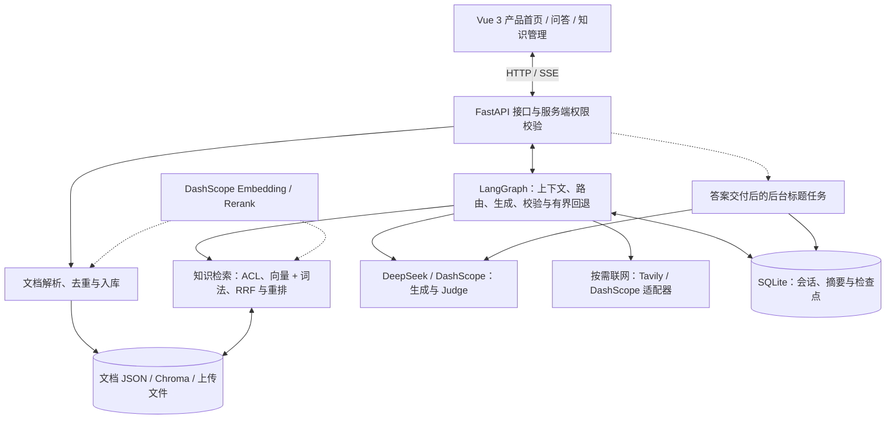

# 企业内部知识助手

一个基于 `LangGraph + DeepSeek/Qwen + FastAPI + Vue 3` 的企业内部知识问答项目，用于将企业制度、流程、合同、财务、人事等内部文档接入知识库，并通过 RAG 提供可检索、可追溯的问答能力。

[当前状态与待办](docs/current_status.md) · [界面预览](#界面预览) · [系统架构](#系统架构) · [快速启动](#快速启动本地开发) · [测试与评测](#测试与评测)

## 项目简介

这个项目面向企业内部场景，核心目标是把企业内部文件沉淀为可检索知识库，并让员工通过对话方式查询制度、流程和规范。

当前能力包括：

- 企业内部知识问答
- 知识库、通用两种会话模式：知识库模式严格依据内部证据，通用模式支持按需联网搜索
- 文件上传并写入知识库
- RAG 检索与回答校验
- 有界多轮会话、自动摘要、首问会话标题生成与完整会话删除
- SSE 状态与正式答案交付；普通通用非联网回答支持增量预览
- Vue 3 产品首页、问答工作台与独立知识管理（FastAPI 接口集成）
- 知识库两层去重
  - 精确去重：内容指纹
  - 近似去重：文本相似度阈值

完整的项目建设顺序、技术选型依据、评测过程和失败闭环见
[《企业内部知识助手：从原型到可评测 RAG 系统的建设思路》](docs/企业内部知识助手_项目建设思路.md)。
Vue 前端的设计系统、目录和当前接入边界见 [frontend/README.md](frontend/README.md)。
统一 RAG 评测目录、运行方式和门禁见
[《统一 RAG 评测》](docs/unified_rag_evaluation.md)。
GitHub 提交边界和本地运行文件清单见
[《GitHub 提交边界》](docs/repository_submission_guide.md)。

## 界面预览

以下截图展示 Vue 页面，问答与文档列表使用确定性合成资料，仅展示界面和交互，不代表真实模型回答质量或企业业务数据。图片随仓库提供，无需访问本地 `work/` 目录。

**产品首页**


**知识问答与引用来源**


**知识管理**


## 系统架构

下图为组件关系，省略了节点内部的有界重试与错误分支；默认本地开发身份不等于企业账号系统。



- 知识库回答使用稳定证据标识消除跨轮编号歧义，验证后转换为接口引用；前端再显示为上标 `[1]`。引用校验支持 `judge` 与 `legacy` 模式，仓库默认使用 `legacy`。
- Tavily 路径检索网页摘要后调用文本模型生成答案；网页来源映射校验不等于独立事实审核。普通通用非联网回答可提前显示预览，`result` 始终是正式结果。
- 文档查看、下载、检索及会话操作都执行服务端授权；模型/工具调用有预算和重试上限。标题任务不阻塞答案交付，目前为单进程最佳努力队列。

具体节点见 [graph.py](backend/agent/graph.py)，接口见 [routes.py](backend/api/routes.py)，配置见 [config.py](backend/config.py)。

## 快速启动（本地开发）

需要 Python 3.11+、Node.js 20.19+ 或 22.12+（Vite 7 支持的版本）与各供应商有效凭据。以下使用 PowerShell，在两个终端分别运行前后端。

**1. 获取源码并安装依赖**

```powershell
git clone https://github.com/hjunhui0924-gif/inner_QA_agent.git
cd inner_QA_agent
python -m pip install -r requirements.txt
npm --prefix frontend ci
```

**2. 配置环境变量**

首次运行复制模板；若已有 `.env`，保留并按需修改，不覆盖现有凭据：

```powershell
if (-not (Test-Path -LiteralPath .env)) {
    Copy-Item -LiteralPath .env.example -Destination .env
}
```

编辑根目录 `.env`，按下表选择配置。完整参数见 [.env.example](.env.example) 和 [配置定义](backend/config.py)。

| 配置 | 必需设置 |
|---|---|
| 保留仓库默认 DashScope | 填写 `DASHSCOPE_API_KEY`；默认文本、Embedding、重排及搜索均走 DashScope，账户需有对应模型权限/额度 |
| 使用 DeepSeek + Tavily | 设置 `MODEL_PROVIDER=deepseek`、`MODEL_NAME=deepseek-v4-pro`、`JUDGE_MODEL_NAME=deepseek-v4-pro`、`CITATION_VALIDATION_MODE=judge`、`WEB_SEARCH_PROVIDER=tavily`；填写 DeepSeek、Tavily、DashScope 各自密钥 |

DeepSeek + Tavily 组合仍由 DashScope 提供 Embedding 和重排。仅体验知识库问答可关闭联网，不需要调用 Tavily。服务不是完全离线运行，真实模型调用可能消耗额度。

**3. 启动后端（终端一，项目根目录）**

```powershell
python -m uvicorn backend.main:app --reload --host 127.0.0.1 --port 8000
```

首次启动会初始化本地 SQLite、Chroma 和种子资料索引，可能调用 Embedding 服务；等待日志显示 `Application startup complete`。项目自带资料为合成种子，不是真实公司制度。

**4. 启动前端（终端二，项目根目录）**

```powershell
npm --prefix frontend run dev -- --host 127.0.0.1 --port 5173 --strictPort
```

| 地址 | 用途 |
|---|---|
| <http://127.0.0.1:5173> | 产品首页 |
| <http://127.0.0.1:5173/chat> | 问答工作台 |
| <http://127.0.0.1:5173/knowledge> | 知识管理 |
| <http://127.0.0.1:8000/health> | 后端健康检查 |
| <http://127.0.0.1:8000/docs> | FastAPI 接口文档 |

Vite 将 `/api` 请求代理到 8000 端口，开发时无需另设前端 API 地址。若启动失败，先检查凭据、模型权限/额度与端口占用；修改 `.env` 后重启后端。`AUTH_MODE=development` 仅用于本地开发，不作为公网多人部署配置。

## 配置与使用说明

配置以根目录 `.env` 为准，修改后需重启后端；不要提交真实凭据。

| 配置项 | 默认值 / 用途 |
|---|---|
| `MODEL_PROVIDER` / `MODEL_NAME` / `JUDGE_MODEL_NAME` | `dashscope` / `qwen3.8-flash` / `qwen3.8-flash` |
| `CITATION_VALIDATION_MODE` | `legacy`；可选 `judge`，先校验引用结构与出处，再由 Judge 判断语义支持 |
| `WEB_SEARCH_PROVIDER` | `dashscope`；可选 `tavily`，需单独填写 `TAVILY_API_KEY` |
| `EMBEDDING_MODEL` / `RERANKER_MODEL` | `qwen3.7-text-embedding` / `gte-rerank-v2` |
| `AUTH_MODE` | `development`，本地单用户身份；多用户接入使用 `trusted_headers` 与可信代理 |
| `REQUEST_MAX_MODEL_CALLS` / `REQUEST_MAX_TOOL_CALLS` / `REQUEST_MAX_TOTAL_SECONDS` | 每次问答最多 12 次模型调用、2 次工具调用、60 秒 |
| `TRACE_ENABLED` / `TRACE_INCLUDE_CONTENT` | 均为 `false`；开启 Trace 后默认只记录元数据和文本指纹 |

- 新会话选择知识库或通用模式，开始对话后锁定。联网搜索需在通用模式中显式开启。
- 普通通用非联网回答支持增量预览；知识库与联网回答校验后交付，SSE `result` 是正式结果。
- 会话自动压缩较早上下文，保留近期对话；删除会话会同时清理聊天记录和 LangGraph 检查点。
- 知识管理支持上传、筛选、详情和来源下载，列表采用每页 10 份的客户端分页。支持 `.txt`、`.md`、`.csv`、`.json`、`.pdf`、`.docx`、`.py`、`.log`，默认上传上限 20 MiB。
- 检索采用向量与中文词法召回、RRF 融合及重排；远程重排失败时回退到 RRF。更换 Embedding 提供方、模型、维度或索引版本会创建新的向量 collection。
- `EMBEDDING_PROVIDER=hashing` 仅用于离线开发和确定性检查，不代表在线语义检索质量，也不会使生成模型自动离线。

## 目录结构

以下展开业务源码与常用入口；省略 Python 包标记 `__init__.py`，同目录的 `*.test.ts` 为前端单元测试。题集、报告及历史文档按用途归类。

```text
backend/                              # 后端服务与 Agent 核心
├── main.py                           # 创建应用，初始化存储与工作流
├── config.py                         # 读取环境配置，校验模型与预算参数
├── api/
│   └── routes.py                     # 问答 SSE、会话和知识文件接口
├── auth/
│   └── access.py                     # 解析可信身份，校验文档访问权限
├── agent/
│   ├── graph.py                      # 组装 LangGraph 节点与执行路径
│   ├── state.py                      # 定义节点共享状态和回答字段
│   ├── nodes.py                      # 实现路由、检索、生成与答案校验
│   ├── edges.py                      # 决定分支、重试与终止条件
│   ├── conversation.py               # 估算上下文用量，规划历史摘要与裁剪
│   ├── checkpoint.py                 # 过滤候选草稿，保存可恢复状态
│   ├── sessions.py                   # 统一会话 ID、操作锁与完整删除
│   ├── memory.py                     # 管理会话存储、文档解析与知识入库
│   ├── citations.py                  # 生成稳定证据标识，校验引用与出处
│   ├── tools.py                      # 封装时间、知识检索及联网工具结果
│   ├── web_search.py                 # 适配 DashScope 搜索，校验网页来源映射
│   ├── tavily_search.py               # Tavily 检索后生成带来源的回答
│   └── title_tasks.py                 # 异步生成会话标题，不阻塞答案交付
├── knowledge/
│   ├── schema.py                     # 规范文档元数据、版本与权限字段
│   ├── chunking.py                   # 按段落切块，控制长度与重叠
│   ├── deduplication.py              # 通过指纹和相似度识别重复文档
│   └── embeddings.py                 # 适配向量模型，区分模型对应的索引
├── retrieval/
│   ├── engine.py                     # 权限过滤、向量/词法召回与 RRF 融合
│   └── reranker.py                   # 适配远程重排，处理超时与失败
├── evaluation/
│   ├── schema.py                     # 定义题目格式，校验题集和语料
│   ├── unified.py                    # 汇总多套题集，统一指标与门禁配置
│   ├── retrieval.py                  # 计算检索指标，归类失败与策略差异
│   ├── answers.py                    # 评估答案事实、引用出处及拒答表现
│   ├── judge.py                      # 调用模型进行可选的语义评分
│   └── runtime.py                    # 提取生成结果，供答案评测使用
└── observability/
    ├── budget.py                     # 限制调用次数/耗时，累计 token 与估算成本
    ├── metrics.py                    # 汇总节点调用次数与耗时
    ├── tracing.py                    # 写入脱敏 Trace，支持日志轮转与保留
    └── safe_errors.py                # 将内部异常映射为可公开的诊断信息

frontend/                             # Vue 3 + TypeScript 前端
├── index.html                        # 页面挂载入口
├── package.json                      # 前端依赖及开发、测试、构建命令
├── package-lock.json                 # 锁定依赖版本，支持可复现安装
├── vite.config.ts                    # 配置 Vue、API 代理与 Vitest
├── tsconfig.json                     # TypeScript 项目配置入口
├── tsconfig.app.json                 # 页面源码类型检查配置
├── tsconfig.node.json                # 构建工具类型检查配置
└── src/
    ├── main.ts                       # 注册路由与 UI 组件，挂载应用
    ├── App.vue                       # 应用根组件，承载路由页面
    ├── router.ts                     # 定义首页、问答和知识管理路由
    ├── env.d.ts                      # 声明 Vite 环境类型
    ├── layouts/
    │   ├── LandingLayout.vue         # 产品首页布局
    │   ├── ChatLayout.vue            # 问答侧栏、移动导航与消息提示
    │   └── ManagementLayout.vue      # 知识管理布局与返回入口
    ├── views/
    │   ├── HomeView.vue              # 产品介绍与工作台入口
    │   ├── ChatView.vue              # 问答展示、输入发送及引用联动
    │   └── KnowledgeView.vue         # 文档筛选、分页、上传与详情入口
    ├── components/
    │   ├── AppSidebar.vue            # 会话搜索、切换、新建与删除
    │   ├── AgentProgress.vue         # 展示当前处理阶段与耗时
    │   ├── EvidencePanel.vue         # 展示引用摘录，定位所选证据卡片
    │   ├── DocumentDetailDrawer.vue  # 查看当前文档信息、文本预览与下载
    │   ├── FailureNotice.vue         # 区分失败与回退，提供恢复操作
    │   ├── WorkspaceDrawer.vue       # 通用抽屉，管理键盘焦点与关闭
    │   └── ToastStack.vue            # 集中展示操作成功和失败提示
    ├── composables/
    │   ├── useWorkspace.ts           # 管理会话、草稿、发送、取消与上传状态
    │   └── useEvidenceSelection.ts   # 绑定回答与引用快照，记录焦点入口
    ├── services/
    │   └── api.ts                    # 封装 HTTP 请求、SSE 解析与文件传输
    ├── types/
    │   └── api.ts                    # 定义接口、流事件和前端消息类型
    ├── utils/
    │   ├── streamState.ts            # 将流事件转换为预览、正式或失败状态
    │   ├── markdown.ts               # 渲染 Markdown，清洗 HTML 并生成引用按钮
    │   ├── attempts.ts               # 合并同一问题的重试记录
    │   ├── sessions.ts               # 搜索会话，选择删除后的接续会话
    │   ├── knowledge.ts              # 文档筛选、排序及元数据展示转换
    │   ├── overlayStack.ts           # 协调嵌套弹层、Esc 与模态状态
    │   ├── clipboard.ts              # 复制文本，兼容剪贴板降级路径
    │   └── performance.ts            # 记录本地交互耗时，不保存问答正文
    └── styles/
        ├── tokens.css                # 定义全局颜色、间距、字号和动效变量
        ├── base.css                  # 基础样式、通用控件与样式入口
        ├── home.css                  # 首页及入口卡片样式
        ├── chat.css                  # 消息、输入框、引用和处理进度样式
        ├── knowledge.css             # 文档列表、筛选和上传界面样式
        └── overlays.css              # 抽屉、弹层与提示样式

scripts/                              # 语料准备、质量评测与性能测量
├── download_eval_corpus.py            # 下载并整理官方评测语料
├── expand_enterprise_knowledge.py     # 扩充和规范企业合成种子资料
├── run_unified_rag_benchmark.py       # 统一运行多题集检索及答案评测
├── run_enterprise_rag_benchmark.py    # 执行企业离线检索回归门禁
├── run_retrieval_benchmark.py         # 对比官方法规语料的检索策略
├── run_retrieval_ablation.py          # 对指定统一题集进行检索策略消融
├── run_answer_benchmark.py            # 评测检索后单次生成的答案质量
├── run_rag_eval.py                    # 执行单份上传文档的基础 RAG 评测
├── benchmark_citation_gate.py         # 对比引用校验策略的通过与拒绝表现
├── benchmark_chat_latency.py          # 测量 HTTP/SSE 问答各阶段延迟
├── run_isolated_chat_latency.py       # 使用隔离语料测量完整 Agent 延迟
└── run_knowledge_quality_audit.py      # 使用隔离真实 Agent 审核合成问答案例

tests/                                # Python 回归与浏览器验收
├── test_*.py                         # 后端逻辑、接口、权限和存储回归
├── e2e_*.py                          # 页面交互与联调（模拟/真实链路见脚本）
├── benchmark_browser_experience.py   # 测量浏览器交互与渲染体验
└── fixtures/                         # 测试文档、固定案例与输入样本

data/                                 # 知识语料、题集与运行数据
├── knowledge_base.json               # 可复现的企业知识种子资料
├── evals/                            # 评测题集、统一清单与门禁阈值
├── eval_reports/                     # 已保存的质量评测报告
├── memory.db                         # 运行生成：会话、偏好及图检查点
├── chroma_db/                        # 运行生成：知识向量索引
├── uploads/                          # 运行生成：上传的原始文档
└── traces/                           # 启用 Trace 后生成的调用记录

docs/                                 # 开发说明、设计方案与验收证据
├── current_status.md                 # 当前有效状态、限制与待办入口
├── dsh_frontend_development_plan.md   # DSH 参考前端改造步骤与验收门禁
├── unified_rag_evaluation.md          # 统一评测流程、指标口径与门禁
├── repository_submission_guide.md    # Git 提交范围与本地文件管理约定
└── assets/                           # README 使用的界面截图

.env.example                          # 环境变量示例，不含真实凭据
.gitignore                            # 排除凭据、运行数据与构建缓存
requirements.txt                      # 后端运行依赖
requirements-e2e.txt                  # 浏览器验收依赖
LICENSE                               # 项目使用许可
```

运行生成的数据默认路径可由配置覆盖，通常不提交 Git；`docs/` 另有阶段设计与历史验收记录，以 [当前状态](docs/current_status.md) 为有效入口。上下文圆环、引用原文精确定位和 PDF 原页预览等规划功能见开发方案，不作为当前源码能力列出。

## 测试与评测

代码回归测试与 RAG 质量题集分别统计。测试数量随代码变化，以本次命令输出为准；下表统计的是质量评测题目，不是单元测试数量。

### 代码回归与浏览器验收

在项目根目录执行：

```powershell
python -m pip install pytest
python -m pytest tests -q
npm --prefix frontend test
npm --prefix frontend run build
```

前端构建包含 TypeScript 类型检查。浏览器验收需先启动 5173 端口的前端，并安装本机 Chrome 或 Edge：

```powershell
python -m pip install -r requirements-e2e.txt
python tests/e2e_mvp_browser.py
```

该脚本注入确定性 API 响应，不调用在线模型。更多布局、交互和真实后端联调命令见 [前端说明](frontend/README.md)。

### RAG 质量评测

统一入口由 [评测目录](data/evals/unified_rag_eval_manifest.json) 管理。按仓库题集核对（2026-09-30），共 **456 题**：

| 数据集 | 题数 | 用途 | 门禁 |
|---|---:|---|---|
| [企业制度](data/evals/enterprise_rag_eval.json) | 414 | 主回归集，包含 development / regression / held_out | 阻断 |
| [官方法规](data/evals/official_policy_retrieval_eval.json) | 34 | 法规安全集，也用于历史答案层开发评测 | 阻断 |
| [东山法律意见书](data/evals/dongshan_legal_opinion_eval.json) | 8 | 旧单文档兼容性检查 | 不阻断 |

企业题集包含 329 道可回答题、85 道不可回答题；企业语料共 50 份文档（49 份合成制度和 1 份上传样例），不代表真实企业内部政策。34 题仍是有效的法规子集，不是项目的全部评测规模。

```powershell
# 在线检索评测，需要 Embedding / Rerank 凭据与配额
python scripts/run_unified_rag_benchmark.py --mode retrieval --top-k 4

# 离线冒烟，单独保存报告，避免覆盖在线基线
python scripts/run_unified_rag_benchmark.py --offline --mode retrieval --report work/evals/unified_rag_smoke.json

# 检索 + 生成 + Judge，会消耗在线模型配额
python scripts/run_unified_rag_benchmark.py --mode all --enable-judge

# 企业题集的确定性离线回归门禁
python scripts/run_enterprise_rag_benchmark.py --split regression --top-k 5
```

**题集规模不等于已完成的在线验收规模。** 仓库保存的 [统一在线报告](data/eval_reports/unified_rag_benchmark.json) 已于 **2026-09-30** 按 456 题完整运行更新（`offline=false`）：整体 Source Hit@4 和 Evidence Recall@4 均为 **100%**，两个阻断门禁均通过，456 题没有检索或证据失败。该报告不包含生成/Judge 结果。

`--offline` 或 `--limit` 的统一评测只标记为 `smoke_only`。检索命中率、短语匹配和自动 Judge 结果各有边界，不等于人工确认的生产回答准确率；统一答案评测也不替代完整 Agent 端到端验收。运行方式、分集门禁及指标解释见 [统一 RAG 评测](docs/unified_rag_evaluation.md)。

企业 414 题四策略消融（2026-09-30，Top-K=5）见 [企业检索策略报告](data/eval_reports/enterprise_retrieval_ablation_20260930.json)：

| 策略 | Source Hit@5 | Evidence Recall@5 | MRR@5 | P50 延迟 |
|---|---:|---:|---:|---:|
| 向量 | 99.70% | 99.70% | 87.99% | 201 ms |
| 词法 | 99.70% | 99.70% | 95.09% | 0.4 ms |
| 融合（RRF） | 99.70% | 99.70% | 90.91% | 204 ms |
| 融合 + 重排 | 100.00% | 100.00% | 94.15% | 520 ms |

这张表覆盖当前主回归集 414 题；34 题法规策略对比仍保留在 [官方检索报告](data/eval_reports/official_policy_retrieval_benchmark.json)，456 题统一结果以统一报告为准。

四种策略使用同一批 414 道企业题、同一份 50 文档语料和同一个 Top-K=5，只改变排序链路：

- **向量**：只做 Embedding 语义召回，能处理同义表达，但在版本、文号和精确规则上排名较弱。
- **词法**：只做 BM25 式中文词法召回，延迟最低，且 MRR 最高；它擅长命中原词、版本号和制度关键词，但对改写问法的鲁棒性有限。
- **RRF 融合**：把向量和词法的候选合并，降低单一召回方式的风险；本次比单独向量略好，但仍有 1 个排名失败。
- **融合 + 重排**：先执行向量召回和词法召回，再做 RRF 融合，最后用 `gte-rerank-v2` 对融合候选重排。本次达到 100% Source Hit 和 Evidence Recall，代价是 P50 延迟约 520 ms。

因此当前生产默认选择融合 + 重排：它在主回归集上提供最完整的证据覆盖。词法策略的 0.4 ms 只是本地词法排序时间，不能直接与包含远程 Embedding/Rerank 网络调用的延迟比较；如果远程重排超时，服务会回退到 RRF，不会交付空结果。MRR 衡量目标来源平均排位，Evidence Recall 衡量 gold evidence 是否出现在返回内容中，两者都不等同于生成答案准确率。

## 主要接口

下列路径为后端直连路径；前端通过 Vite 的 `/api` 代理访问。完整请求、响应定义见启动后的 [FastAPI 文档](http://127.0.0.1:8000/docs)。

| 方法 | 路径 | 用途 |
|---|---|---|
| `POST` | `/chat/stream` | SSE 问答 |
| `GET` | `/chat/sessions/{user_id}` | 会话列表 |
| `GET` | `/chat/history/{user_id}/{session_id}` | 会话历史 |
| `DELETE` | `/chat/session/{user_id}/{session_id}` | 删除会话 |
| `POST` | `/knowledge/upload` | 上传知识文件 |
| `GET` | `/knowledge/records` | 知识条目列表 |
| `GET` | `/health` | 健康检查 |

## 使用边界与后续工作

- 已有服务端 ACL，覆盖检索、来源查看与下载、会话操作和知识管理。多用户部署仍需接入可信身份、迁移历史文档 ACL 并验收权限；请求中的 `user_id` 不作为身份凭据。
- 当前知识管理未提供文档编辑、删除及版本回滚；PDF 表格解析仍可改进。
- 标题生成使用单进程后台队列，不是持久化任务系统。跨进程协调和规模化部署需另行设计。
- 2026-10-02 已续验四种浏览器及合成多版本真实问答；真机软键盘、同配置前后性能收益、账单成本和独立真实业务质量仍待验收。详见 [当前状态](docs/current_status.md) 与 [M6 记录](docs/m6_acceptance_2026-10-02.md)。网页来源校验不等于独立事实审核。

## 进一步阅读

- [项目建设思路](docs/企业内部知识助手_项目建设思路.md)：技术选型、建设顺序和失败闭环。
- [前端说明](frontend/README.md)：页面、开发命令和浏览器验收。
- [统一 RAG 评测](docs/unified_rag_evaluation.md) / [企业知识库扩充记录](docs/knowledge_base_expansion.md)：题集、来源和门禁。
- [引用校验分工](docs/citation_validation_split_report.md) / [稳定证据标识](docs/stable_evidence_identity_fix.md)：引用协议与语义校验。
- [产品体验验收记录](docs/product_experience_final_acceptance.md) / [交互修复记录](docs/interaction_recovery_implementation.md)：对应阶段的验收结果与限制，历史测试数字不代表当前测试总数。
- [GitHub 提交边界](docs/repository_submission_guide.md)：运行产物、凭据和可复现资料的管理。

## License

[MIT](LICENSE)
